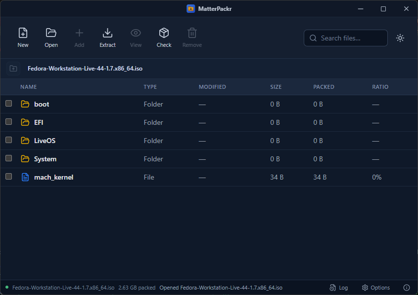

# MatterPackr

<div align="center">
  
  <h3>Modern, ultra-fast, and portable archive manager</h3>
  <p>Built with <strong>Tauri 2</strong>, <strong>React 19</strong>, <strong>TypeScript</strong>, and <strong>Rust</strong>.</p>
  <br />
  
</div>

---

## 📥 Downloads

Get the latest official release for your operating system:

| Platform | Architecture | Installer / Package | Type |
| :--- | :--- | :--- | :--- |
| **Windows** | 64-bit (`x64`) | [**MatterPackr Setup (.exe)**](https://github.com/Z-Sofware-Labs/MatterPackr/releases/latest/download/MatterPackr_1.1.0_x64-setup.exe) | NSIS Installer |
| **Windows** | 64-bit (`x64`) | [**MatterPackr Package (.msi)**](https://github.com/Z-Sofware-Labs/MatterPackr/releases/latest/download/MatterPackr_1.1.0_x64_en-US.msi) | MSI Installer |
| **macOS** | Universal (`Apple Silicon & Intel`) | [**MatterPackr DMG (.dmg)**](https://github.com/Z-Sofware-Labs/MatterPackr/releases/latest/download/MatterPackr_1.1.0_universal.dmg) | Universal Disk Image |
| **Linux** | 64-bit (`x86_64`) | [**MatterPackr Fedora / RHEL (.rpm)**](https://github.com/Z-Sofware-Labs/MatterPackr/releases/latest/download/MatterPackr-1.1.0-1.x86_64.rpm) | Fedora / RHEL / openSUSE |
| **Linux** | 64-bit (`x86_64`) | [**MatterPackr Debian Package (.deb)**](https://github.com/Z-Sofware-Labs/MatterPackr/releases/latest/download/matterpackr_1.1.0_amd64.deb) | Ubuntu / Debian / Mint |

> 📦 View all release assets, changelogs, and updater signatures on the [**Latest GitHub Release Page**](https://github.com/Z-Sofware-Labs/MatterPackr/releases/latest).

---

## 🌟 Overview

**MatterPackr** is a lightweight, cross-platform archive manager designed as a modern, high-performance alternative to legacy archivers like 7-Zip and WinRAR. 

It combines the raw speed and memory safety of **Rust** with a sleek, responsive **React** desktop interface. All archive and disk image operations are performed **100% in-process in userspace**—meaning **zero external process dependencies, zero operating system disk mounting, and zero elevated privileges (`sudo` / administrator) required**.

---

## 🚀 Key Features

### 🗜️ Broad Format Support
- **Create & Extract**:
  - `ZIP` (Deflate, Bzip2, Zstandard, AES-256 encryption)
  - `7Z` (LZMA2, AES-256 password protection)
  - `TAR`, `TAR.GZ` (`.tgz`), `TAR.BZ2` (`.tbz2`), `TAR.XZ` (`.txz`)
  - `GZ`, `BZ2`
- **Extract & Inspect Only**:
  - `RAR` (including password-encrypted archives)
  - `ISO` & `IMG` (Pure in-process UDF & ISO 9660 with Rock Ridge extensions)
  - `CAB` (Microsoft Cabinet)
  - `CPIO` & `AR` (Unix container formats)

### ⚡ Blazing Fast & Memory-Efficient
- **128 KB Buffered I/O**: Eliminates disk thrashing during archive inspection, testing, and streaming decompression.
- **$O(1)$ Compressed Stream Inspection**: Instant size querying for multi-gigabyte `.gz` archives without decompressing the entire payload.
- **Instant File Preview**: Selective extraction unpacks only the selected file into isolated storage on double-click instead of unpacking the entire archive.

### 💿 100% In-Process Optical Image Engine (UDF & ISO 9660)
- **Zero OS Mounting**: Reads `.iso` disk images directly from raw bytes in userspace.
- **No File Explorer Popups**: Opening a disk image never triggers OS AutoPlay, virtual drive letters, or desktop file manager popups.
- **True Dual UDF/ISO 9660 Support**: Correctly enumerates multi-gigabyte Windows 11 installation images (`boot`, `efi`, `sources`, `setup.exe`) and Linux distributions (e.g. Fedora, Ubuntu) in milliseconds.
- **100% Portable**: Requires no `sudo`, loop devices, or OS drivers—making it identical across Windows, Linux, and macOS.

### 📁 In-Place Directory Navigation (7-Zip / Explorer Style)
- **Flat In-Place Browsing**: Double-clicking a directory navigates directly into the folder within the same window, displaying only its immediate contents.
- **Parent Directory Row (`..`)**: One-click and double-click return to parent directory via the top `..` row.
- **Interactive Breadcrumb Address Bar**: Click any folder segment in the path bar (`Archive / folder / subfolder`) to jump immediately to that directory level.
- **Keyboard Navigation**: Press `Backspace` to instantly jump up one directory level.

### 🖱️ Drag & Drop Integration
- **Extract via Drag-and-Drop**: Drag any file or directory from MatterPackr directly out into Windows File Explorer, desktop, or applications.
- **Drop to Add**: Drag external files into MatterPackr to add them directly to the archive (automatically targeting the currently open folder).

### 🔒 Security & Conflict Handling
- **Password Protection**: Full support for opening, viewing, testing, and extracting encrypted ZIP, 7Z, and RAR archives.
- **Smart Conflict Resolution**: Prompts when collisions occur on extraction with **Overwrite**, **Auto-Rename**, or **Cancel** options.

### 🔄 On-Demand In-App Updates (GitHub Releases)
- **Manual On-Demand Check**: Check for updates whenever you choose via a dedicated **Update** button on the bottom status bar (zero unwanted background auto-updating).
- **GitHub Releases Integration**: Queries `https://github.com/z-software-labs/matterpackr/releases/latest/download/latest.json`.
- **Cryptographic Minisign Signatures**: Every release package is cryptographically signed and verified in-process before installation.
- **One-Click Update & Restart**: View version differences and release notes, inspect live download progress, and restart with a single click.

### 🎨 Refined User Experience
- **Sleek Light & Dark Themes**: Hand-crafted themes optimized for readability with high-contrast active states.
- **Frameless Window**: Custom titlebar with native OS window controls and drag regions.
- **Integrated Activity Log**: Real-time logging console capturing Rust and WebView events.
- **Windows File Associations**: Register MatterPackr as the default handler for any supported archive extensions.

---

## 🛠️ Architecture

```
MatterPackr Desktop
├── Frontend (React 19 + TypeScript + Vite + Tailwind CSS)
│   ├── In-place Directory Explorer & Breadcrumb Navigation
│   ├── Drag-and-Drop Handler & Visual Indicators
│   ├── Conflict Resolution & Password Prompts
│   └── System & Custom Dark/Light Theming
│
└── Backend (Rust + Tauri 2)
    ├── backend::zip          (Buffered ZIP engine + AES crypto)
    ├── backend::sevenz       (7-Zip compression/decompression)
    ├── backend::disk_image   (In-process UDF & ISO 9660 parser)
    ├── backend::libarchive   (TAR, GZ, BZ2, XZ, CAB, CPIO, AR)
    ├── backend::unrar        (RAR decompression)
    └── backend::associations (Windows registry file association manager)
```

---

## 📦 Building from Source

### Prerequisites
- [Node.js](https://nodejs.org/) (v18 or later)
- [Rust](https://www.rust-lang.org/tools/install) (1.78+ with `cargo`)
- Platform build essentials:
  - **Windows**: Visual Studio C++ Build Tools
  - **Linux**: `libwebkit2gtk-4.1-dev`, `build-essential`, `curl`, `wget`, `file`, `libxdo-dev`, `libssl-dev`

### Quick Start

1. **Clone the repository**:
   ```bash
   git clone https://github.com/z-software-labs/matterpackr.git
   cd matterpackr
   ```

2. **Install dependencies**:
   ```bash
   npm install
   ```

3. **Run in development mode**:
   ```bash
   npm run tauri dev
   ```

### Production Release Build & Updates
 
To compile an optimized, standalone release package:
 
```bash
npm run tauri build
```

To build and sign an update bundle for GitHub Releases:
```bash
# Set your private key environment variable (or pass via CI secret)
export TAURI_SIGNING_PRIVATE_KEY="$(cat src-tauri/matterpackr.key)"
npm run tauri build
```

This generates `latest.json` alongside the signed installer archives in `src-tauri/target/release/bundle/`. Simply upload `latest.json` and the `.zip`/`.tar.gz`/`.sig` assets to your GitHub Release!
 
The output installers and binaries will be placed in:
- **Windows NSIS Installer**: `src-tauri/target/release/bundle/nsis/MatterPackr_1.0.9_x64-setup.exe`
- **Windows MSI Package**: `src-tauri/target/release/bundle/msi/MatterPackr_1.0.9_x64_en-US.msi`
- **Standalone Portable Binary**: `src-tauri/target/release/matterpackr.exe`
- **Updater Manifest**: `src-tauri/target/release/bundle/latest.json`

---

## 🧪 Testing

Run backend unit and integration tests:

```bash
cargo test --manifest-path src-tauri/Cargo.toml --lib
```

Check TypeScript code without building:

```bash
npx tsc --noEmit
```

---

## 📄 License

Copyright © 2026 Z Software Labs. All rights reserved.
Distributed under the MIT License. See `LICENSE` for details.
